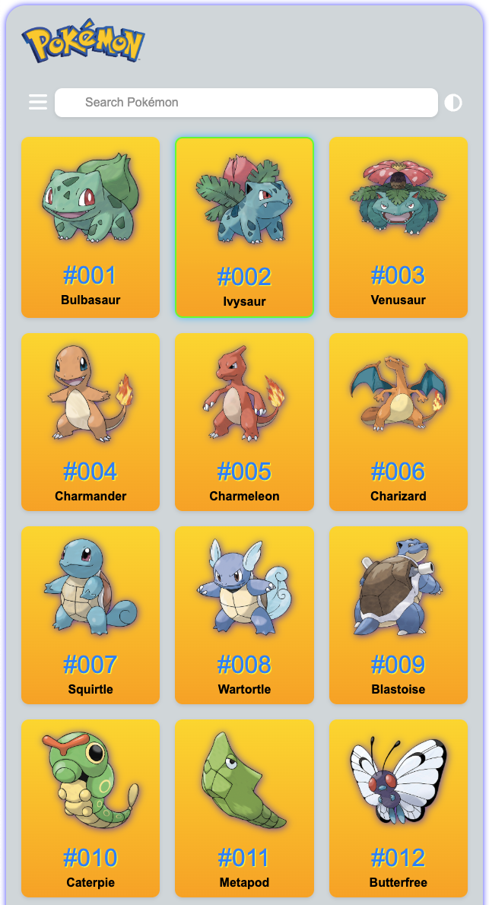
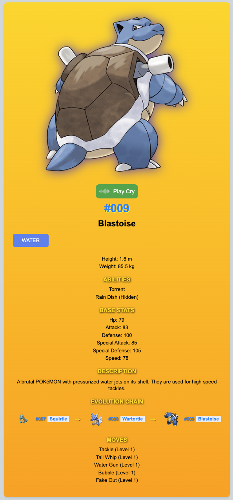
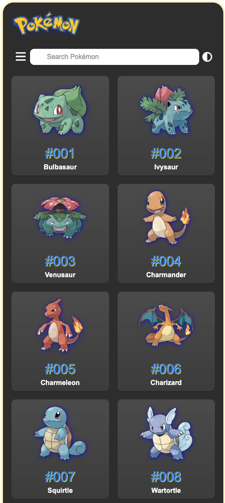

# React TS Project Pokémon Explorer
A React-based web application for exploring Pokémon details, featuring a searchable list, type filtering, and detailed Pokémon profiles with evolution chains.

🔍 Features
Pokémon list (Gen 1, 151 Pokémon)

Name / ID / Official artwork display

Search bar (filter by name)

Type filter (multi-select)

Details page (stats, abilities, moves, evolution chain)

Clickable evolution links

Theme toggle (light/dark mode)

Loading animation (Poké Ball spinner)

🕹️ Usage
Browse Pokémon grid on homepage

Search by name using the search bar

Open type filter via menu icon

Select types → click "Search"

Click a card to view detailed info

Interactive evolution chain navigation

Toggle theme with header icon

💻 Technologies
React (hooks, context API)

TypeScript (type safety)

PokéAPI (data source)

CSS (custom styles, light/dark support)

🤝 Contributing
Fork the repo

Submit pull requests

Report issues via GitHub

📄 License
MIT License